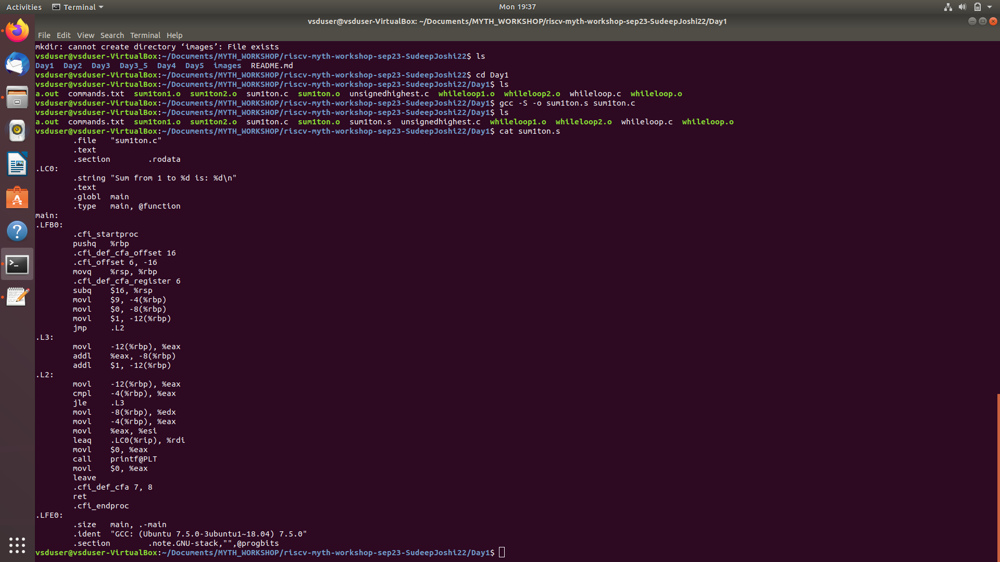
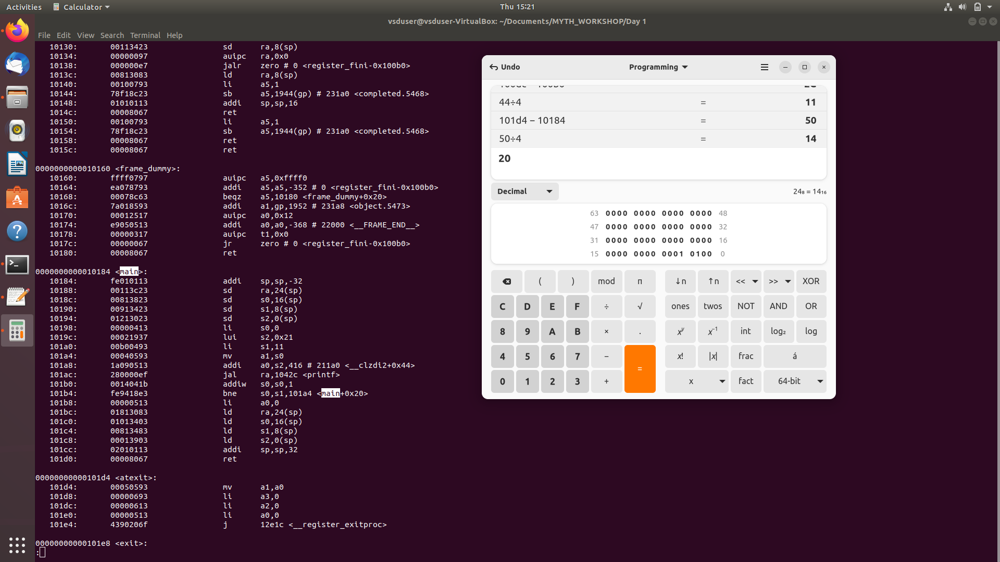
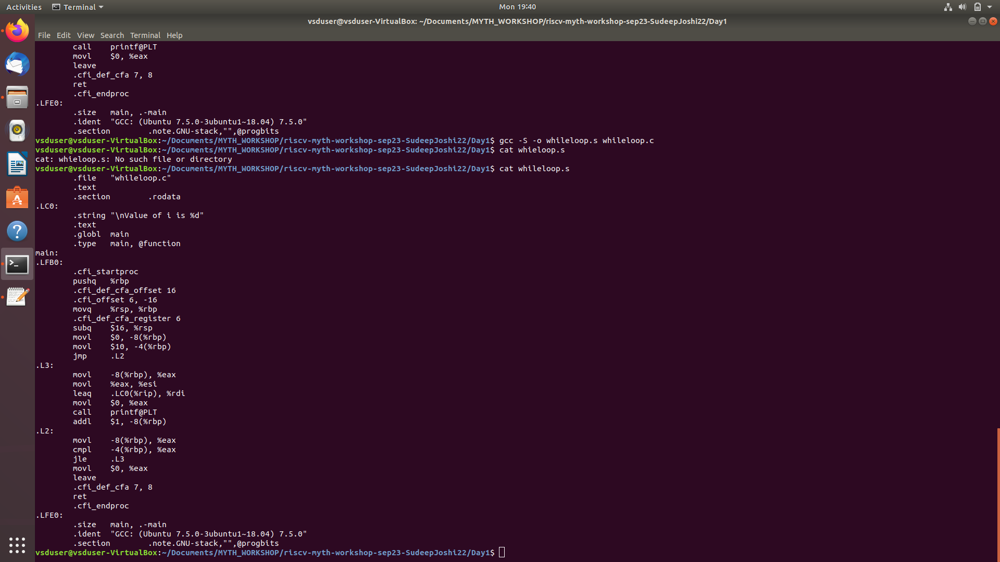
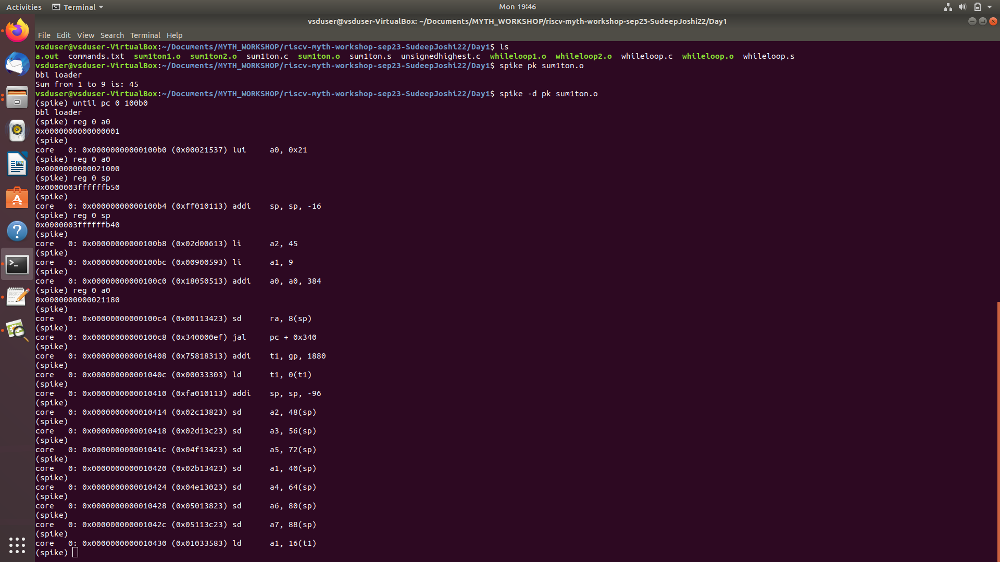
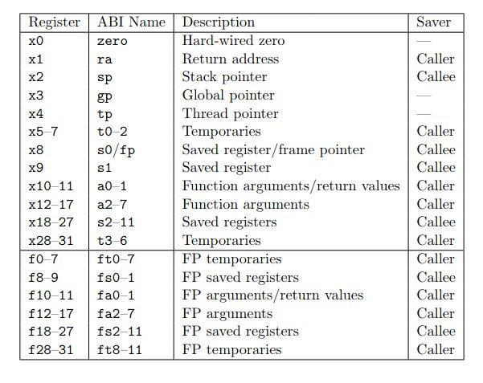
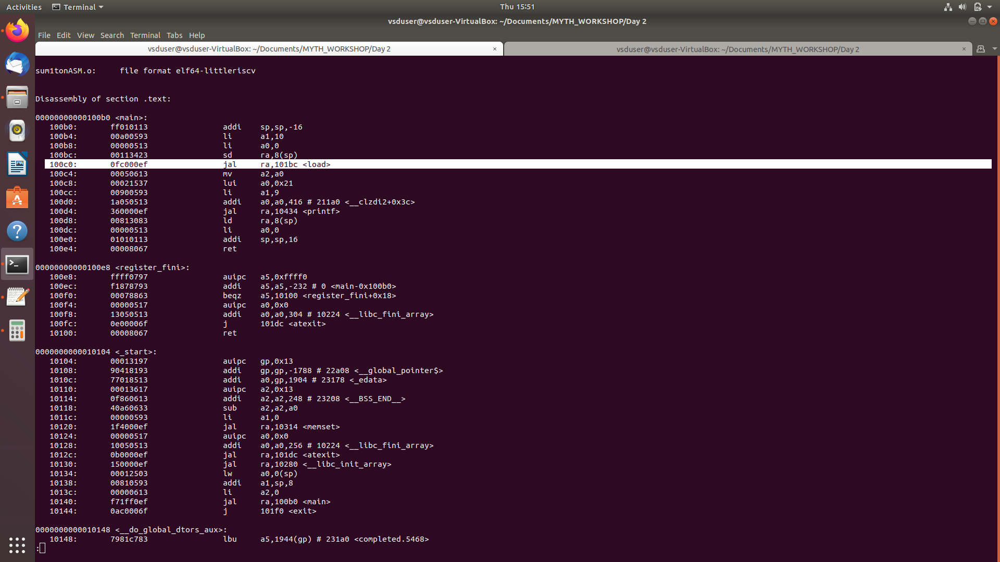
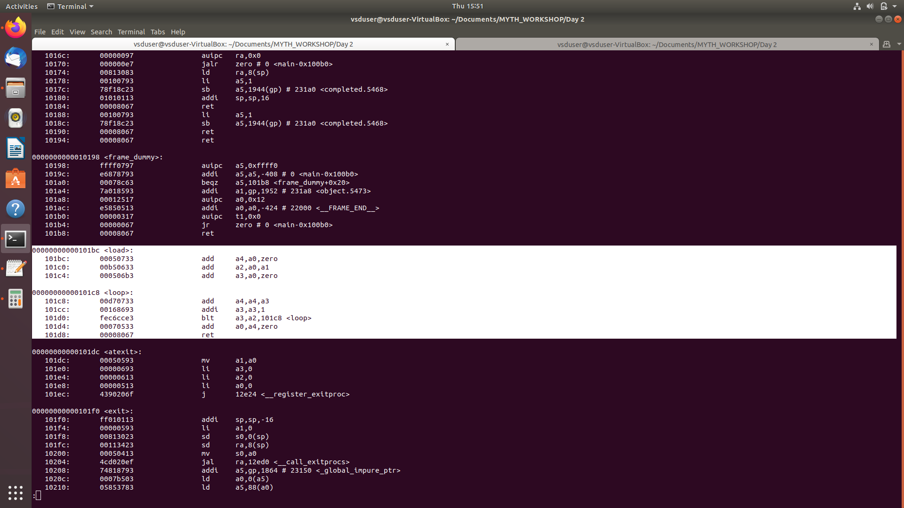
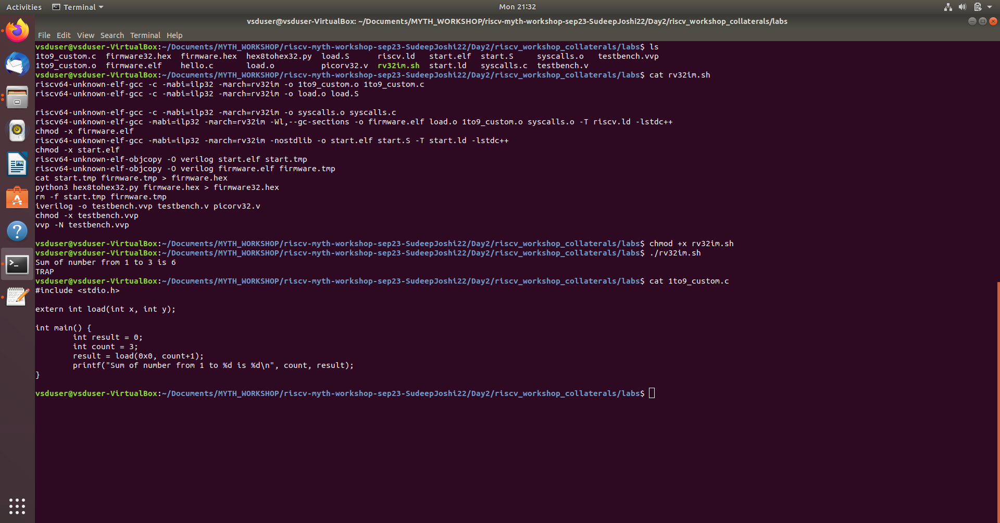

# RISC-V_MYTH_Workshopspike pk sum1ton.o
"Microprocessor for You in Thirty Hours" Workshop, offered by for [VLSI System Design (VSD)](https://www.vlsisystemdesign.com/) and [Redwood EDA](https://www.redwoodeda.com/).
Submitted by [Sudeep Joshi](https://www.lindedin.com/in/sudeep-joshi-569951207/).

### Overview of the Days
1. Day 1 - Introduction to [RISC-V ISA](https://riscv.org/technical/specifications/) and [RISCV-GNU-TOOLCHAIN](https://github.com/riscv-collab/riscv-gnu-toolchain) and [SPIKE simulator](https://github.com/riscv-software-src/riscv-isa-sim).
2. Day 2 - Application Binary Interface(ABI) and Verification flow
3. Day 3 - Digital Logic with [TL-Verilog](https://github.com/TL-X-org/tlv_flow_lib) and [Makerchip](https://www.makerchip.com/)
4. Day 4 - Basic RISC-V CPU Microarchitecture
5. Day 5 - Pipelined RISC-V CPU Microarchitecture

# Day 1 - Introduction to RISC-V, RISC-V GNU Compiler Toolchain and SPIKE Simulator
**RISC-V** is an open-source **Instructioin Set Architecture(ISA)** which has gained significant attention in recent years. It offers flexibility for designing custom processors, making a popular choice for academia and industry. **RV32I** stands for RISC-V 32-bit Integer, which is the base-ISA.
**RISC-V GNU Compiler Toolchain** is the RISC-V C and C++ cross-compiler which allows us to compile C and C++ program in RISC-V ISA and run on simulators.

### [Sum 1 to N program](Day1/sum1ton.c) 
-Following command on the Linux terminal is used to compile the C program.
```
riscv64-unknown-elf-gcc -O1 -mabi=lp64 -march=rv64i -o sum1ton.o sum1ton.c
```
RISC-V GNU Compiler Toolchain allows two modes of compilation namely, ``` -O1 ``` and ``` -Ofast ```. ``` -Ofast ``` mode asks the compiler to do extensive optimization during the conversion of C to assembly.

To view the compiler assembly code following command is used.
```
riscv64-unknown-elf-objdump -d sum1ton.o | less
```
-Generated RISC-V Assembly code:

By looking at the address range of the **<main>** section total number of assembly instructions generated is calculated which came up to 11 for both -O1 and -Ofast modes.

-Same code can be compiled using GNU compiler, which converts it to X86 assembly instructions.
```
gcc -S -o sum1ton.s sum1ton.c
```



### [While loop program](Day1/whileloop.c)
- RISC-V Assembly

- X86 


### SPIKE Simulator
Spike, the RISC-V ISA Simulator, implements a functional model of one or more RISC-V harts.
Following command can be used to invoke SPIKE simulator
'''
spike pk sum1ton.o
'''
for debug mode
'''
spike -d pk sum1ton.o
'''
- SPIKE Step output

Using spike debug mode program is run until the address 0x100b0 and individual registers are observed.

# Day 2 - Application Binary Interface(ABI) and Verification flow
Application Binary Interface(ABI) is a specification that defines the conventions and rules for how software interacts with the hardware on RISC-V processors.


### ABI Function call ([sum1tonASM.c](sum1tonASM.c))
Following file [load.s](Day2/load.s) contains the RISC-V assembly program to find sum from 1 to N. Registers a0 and a1 carry the input arguments and the result is returned using a0 register. Hence the result which is contained in the a4 is moved to a0 before ret instruction.



In the assembly code generated by the RISC-V GNU we can observe that at the address 0x100c0 'load' function is being called using 'jal' instruction and the 'load' and 'lopp' sections of the code is exactly same as the assembly code written in load.s.

### Design verification using [iverilog](https://github.com/steveicarus/iverilog)
Icarus Verilog is an open-source Hardware Description Language(HDL) simulator. In the lab the compiled program is converted to .hex file and fed to the RTL design of [picorv32](https://github.com/YosysHQ/picorv32).
Commands to run:
```
chmod +x rv32im.sh
./rv32im.sh
```
The .sh has all the commands to compile the C program, converting the binary to hex format which can be read by the verilog design using '$readmemh()'.
Contents of rv32im.sh
```
riscv64-unknown-elf-gcc -c -mabi=ilp32 -march=rv32im -o 1to9_custom.o 1to9_custom.c 
riscv64-unknown-elf-gcc -c -mabi=ilp32 -march=rv32im -o load.o load.S

riscv64-unknown-elf-gcc -c -mabi=ilp32 -march=rv32im -o syscalls.o syscalls.c
riscv64-unknown-elf-gcc -mabi=ilp32 -march=rv32im -Wl,--gc-sections -o firmware.elf load.o 1to9_custom.o syscalls.o -T riscv.ld -lstdc++
chmod -x firmware.elf
riscv64-unknown-elf-gcc -mabi=ilp32 -march=rv32im -nostdlib -o start.elf start.S -T start.ld -lstdc++
chmod -x start.elf
riscv64-unknown-elf-objcopy -O verilog start.elf start.tmp
riscv64-unknown-elf-objcopy -O verilog firmware.elf firmware.tmp
cat start.tmp firmware.tmp > firmware.hex
python3 hex8tohex32.py firmware.hex > firmware32.hex
rm -f start.tmp firmware.tmp
iverilog -o testbench.vvp testbench.v picorv32.v
chmod -x testbench.vvp
vvp -N testbench.vvp
```
Output:


